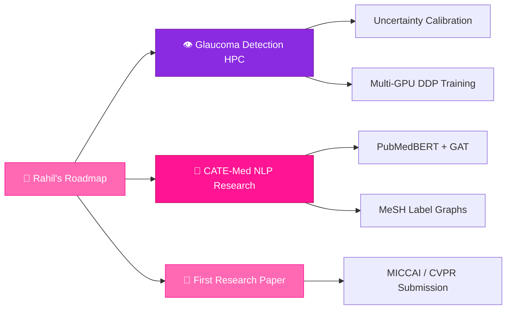

<!-- ============================================================ -->
<!--   🌸 RAHIL GHANEM — GITHUB PROFILE README                   -->
<!--   Username: RahilGhanem (already set — just verify!)         -->
<!--   Email: rahil.ghanem@ensia.edu.dz (already set)            -->
<!--   Replace YOUR_LINKEDIN_USERNAME with your actual handle     -->
<!-- ============================================================ -->

<div align="center">

<!-- ✦ ANIMATED HEADER BANNER ✦ -->


<!-- ✦ MULTILINGUAL GREETING ✦ -->
<h2>
  مرحباً &nbsp;•&nbsp; Salam 3likom &nbsp;•&nbsp; Bonjour &nbsp;•&nbsp; Hello 👋
</h2>

<!-- ✦ ANIMATED TYPING EFFECT ✦ -->
[](https://git.io/typing-svg)

<br/>

<!-- ✦ PROFILE VIEWS & FOLLOWERS ✦ -->

&nbsp;
[](https://github.com/RahilGhanem)

</div>


---

##  &nbsp;About Me


```python
class RahilGhanem:
    school       = "ENSIA — National Higher School of AI, Algeria"
    degree       = "AI Engineering (Specialist Cycle 2022–2027)"
    location     = "Batna, Algeria 🇩🇿"
    fun_fact = "Just a girl teaching computers how to see 👁️🌸"

    def say_hi(self):
        print("Welcome to my corner of GitHub — let's build something great!")
```

<br clear="right"/>


</div>


---


## 🌸 &nbsp;Tech Stack & Skills

<div align="center">

### 🧠 &nbsp;AI & Machine Learning
<a href="#"></a>
<br/>


### 💻 &nbsp;Development & Frameworks
<a href="#"></a>

### 🗄️ &nbsp;Data & Databases
<a href="#"></a>
<br/>


### 🔧 &nbsp;Tools & Hardware
<a href="#"></a>
<br/>


</div>


---

## 🚀 &nbsp;Projects

### 👁️ &nbsp;Glaucoma Detection — HPC Deep Learning Pipeline
> *Flagship Research Project*

A state-of-the-art quality-aware glaucoma diagnostics pipeline built and trained on HPC infrastructure.

- **Heterogeneous ensemble** of EfficientNet-V2, Swin Transformer & ConvNeXt-V2 for full-spectrum retinal feature extraction
- Custom **Quality-Weighted Focal Loss (QWFL)** to handle blurry/low-quality fundus images without data loss
- **Monte Carlo Dropout** uncertainty engine — alerts clinicians when model confidence is low
- **GradCAM++ & Attention Rollout** for clinical explainability across the Optic Nerve Head

<div align="center">

[](https://github.com/RahilGhanem/Glaucoma-Detection-HPC)
&nbsp;
[](#)

</div>

---

### 🗣️ &nbsp;NABA2 — Algerian Darija Misinformation Detection
> *NLP · Dataset Construction · Transformers*

Contributed to **NABA2**, a large-scale annotated corpus of 22,000+ samples for multi-class misinformation detection in Algerian Darija. Worked on annotation validation and trained classical ML, neural, and transformer models to classify content into: Real · Misleading · False · Satire · Non-news.

---

### 🌐 &nbsp;Automated Network Path Optimizer
> *Internship @ Algérie Télécom, Barika — Sept 2025*

Full-stack system automating fiber network path selection, bandwidth allocation, and ODB management. Implemented a **modified Dijkstra algorithm** with an interactive map visualization in Python/Flask. Used during actual operations for network planning and auditing.

---

### 🏫 &nbsp;ENSIA Timetabling System
> *AI Optimization · Constraint Solving*

AI-driven academic timetable generator using real institutional data (teacher schedules, room allocation). Reduced scheduling conflicts and improved resource efficiency across the school.

---

### 🏥 &nbsp;Health Clinic Surgery Management System
> *AI Scheduling · Healthcare*

Intelligent platform to schedule surgeries, assign operating rooms and staff, and dynamically estimate procedure durations based on patient conditions. Optimized hospital workflow and patient care delivery.

---

### 📱 &nbsp;Other Projects

| Project | Description | Stack |
|:---|:---|:---|
| 🗺️ **Tourista** | Guided mobile tour app for Algeria's major tourist sites | Flutter |
| 💾 **Distributed Storage App** | AI-enhanced mobile platform for distributed data sync across devices | Flutter · ML |


---

## 🏅 &nbsp;Leadership & Activities

<div align="center">

| 🎯 Activity | 📋 Details |
|:---|:---|
| 🏆 **AI/Optimization Competitions** | Competed in AI/optimization tracks; built ML models for robotics, healthcare, finance & quantum computing |
| 💡 **Nest Hackathon — Mobilis** | Developed hardware/software solutions to server-room operational challenges |
| 🌸 **Founder — Languatech Club, Barika** | Founded & lead a tech club delivering workshops on programming, UI/UX, and digital literacy |

</div>


---

## 📊 &nbsp;GitHub Analytics

<div align="center">


&nbsp;


<br/><br/>


</div>

### 📈 &nbsp;Contribution Graph

<div align="center">

[](https://github.com/ashutosh00710/github-readme-activity-graph)

</div>


---

## 🚀 &nbsp;Currently Working On




---

## 💬 &nbsp;Philosophy

<div align="center">

> ### ***"Be the change you want to see in the world."***

</div>


---

## 📫 &nbsp;Let's Connect

<div align="center">

<a href="https://linkedin.com/in/YOUR_LINKEDIN_USERNAME">
  
</a>
&nbsp;
<a href="mailto:rahil.ghanem@ensia.edu.dz">
  
</a>
&nbsp;
<a href="https://github.com/RahilGhanem">
  
</a>
&nbsp;
<a href="https://kaggle.com/YOUR_KAGGLE_USERNAME">
  
</a>

<br/><br/>

[](https://linkedin.com/in/YOUR_LINKEDIN_USERNAME)
&nbsp;
[](mailto:rahil.ghanem@ensia.edu.dz)
&nbsp;
[](https://www.researchgate.net/profile/YOUR_RESEARCHGATE_PROFILE)
&nbsp;
[](https://kaggle.com/YOUR_KAGGLE_USERNAME)

<br/><br/>

*Open to research collaborations · Paper co-authorships · AI internships · PhD opportunities*

</div>

<div align="center">


*🌸 &nbsp;Crafted with passion, caffeine, and a deep pink aesthetic — Rahil Ghanem &nbsp;🌸*

</div>
