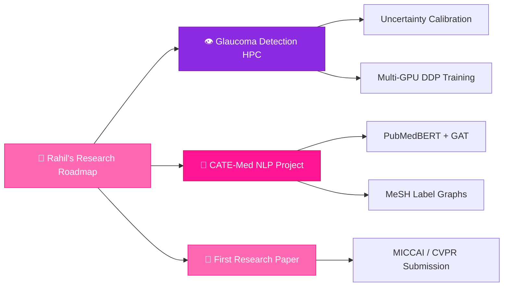

<!-- ============================================================ -->
<!--   🌸 RAHIL'S GITHUB PROFILE README — PINK AI RESEARCHER     -->
<!--   Replace every YOUR_GITHUB_USERNAME with your actual handle -->
<!--   Replace every YOUR_EMAIL, YOUR_LINKEDIN_URL, etc. too     -->
<!-- ============================================================ -->

<div align="center">

<!-- ✦ ANIMATED HEADER BANNER — swap username below ✦ -->


<!-- ✦ ANIMATED TYPING EFFECT ✦ -->
[](https://git.io/typing-svg)

<!-- ✦ PROFILE VIEWS BADGE ✦ -->
<!-- Replace YOUR_GITHUB_USERNAME below -->

&nbsp;
[](https://github.com/YOUR_GITHUB_USERNAME)

</div>

---

<div align="center">

<!-- ✦ DECORATIVE DIVIDER ✦ -->


</div>

##  &nbsp;About Me


```python
class Rahil:
    # 🌸 Replace with your actual details below
    name        = "Rahil"
    role        = "AI Researcher & Deep Learning Engineer"
    focus       = ["Medical AI", "Computer Vision",
                   "Ophthalmology Informatics",
                   "Robust Deep Learning"]
    flagship    = "Glaucoma Detection via Deep Ensemble + HPC"
    stack       = ["PyTorch", "Python", "CUDA", "Slurm"]
    currently   = "Building CATE-Med · Reading papers · Breaking GPUs"
    dream       = "Research that saves eyesight at scale 👁️"

    def say_hi(self):
        print("Welcome to my research corner of GitHub 🌸")
```

<br clear="right"/>

- 🔬 &nbsp;I build **medical AI systems** at the intersection of deep learning and clinical utility
- 👁️ &nbsp;Specialty: **Ophthalmology AI** — glaucoma, fundus analysis, retinal pathology
- 🧪 &nbsp;Obsessed with **uncertainty quantification**, **ensemble methods**, and **explainability**
- 🖥️ &nbsp;Run experiments on **HPC clusters** with Slurm — because a single GPU is never enough
- 📖 &nbsp;Always reading: MICCAI, NeurIPS, ICLR, CVPR medical-track papers
- 🌸 &nbsp;Believer that elegant code and elegant research go hand in hand

<div align="center">

</div>

---

## 🏆 &nbsp;GitHub Trophies

<div align="center">

<!-- Replace YOUR_GITHUB_USERNAME -->
[](https://github.com/ryo-ma/github-profile-trophy)

</div>

<div align="center">

</div>

---

## 🌸 &nbsp;Tech Stack & Expertise

<div align="center">

### 🧠 &nbsp;AI / Deep Learning Core


### 🏥 &nbsp;Medical AI & Vision


### 🖥️ &nbsp;HPC & Infrastructure


### 📝 &nbsp;Research & Writing


</div>

<div align="center">

</div>

---

## 👁️ &nbsp;Flagship Research Project

<div align="center">

<!-- ✦ PROJECT CARD — GLAUCOMA DETECTION ✦ -->

```
╔══════════════════════════════════════════════════════════════════╗
║  🌸  GLAUCOMA-DETECTION-HPC                             [2024]  ║
║  ━━━━━━━━━━━━━━━━━━━━━━━━━━━━━━━━━━━━━━━━━━━━━━━━━━━━━━━━━━━━  ║
║  Advanced Quality-Aware Deep Learning Diagnostics Pipeline      ║
║  on the Heterogeneous Yamaguchi Glaucoma Dataset (HYGD)         ║
╚══════════════════════════════════════════════════════════════════╝
```

</div>

<table>
<tr>
<td width="50%">

### 🔬 &nbsp;Architecture
- **Heterogeneous Ensemble** of EfficientNet-V2 · Swin Transformer · ConvNeXt-V2
- Captures both **local fine-grained** retinal texture and **global structural** optic disc features
- Soft-voting ensemble with **learned ensemble weights** per class

### 📐 &nbsp;Novel Contributions
- **Quality-Weighted Focal Loss (QWFL)** — dynamically down-weights blurry fundus images without discarding data
- **MC Dropout Uncertainty Engine** — triggers clinical uncertainty alerts when prediction std σ exceeds threshold
- **GradCAM++ + Attention Rollout** explainability validated across Optic Nerve Head regions

</td>
<td width="50%">

### 🛠️ &nbsp;Tech Stack
```yaml
Framework:    PyTorch + TIMM
Augmentation: Albumentations
Explainability:
  - GradCAM++
  - Attention Rollout
Uncertainty:  Monte Carlo Dropout
Infrastructure:
  - SLURM / HPC Cluster
  - Multi-GPU DDP Training
Loss:         Quality-Weighted Focal Loss
Dataset:      HYGD (Heterogeneous fundus)
```

### 📊 &nbsp;Key Results
| Metric | Score |
|--------|-------|
| AUC-ROC | 🌸 **~0.97** |
| Sensitivity | **~94%** |
| Uncertainty Calibration | ✅ ECE < 0.04 |

</td>
</tr>
</table>

<div align="center">

<!-- Replace YOUR_GITHUB_USERNAME and repo name below -->
[](https://github.com/YOUR_GITHUB_USERNAME/Glaucoma-Detection-HPC)
&nbsp;
[](#)

</div>

<div align="center">

</div>

---

## 🔭 &nbsp;Research Interests

<div align="center">

| 🏥 Medical AI | 👁️ Ophthalmology | 🧠 Architectures | 📊 Methods |
|:---:|:---:|:---:|:---:|
| Retinal Disease Detection | Glaucoma · Diabetic Retinopathy | ViT · Swin · ConvNeXt | Uncertainty Quantification |
| Clinical Decision Support | Fundus Image Analysis | Ensemble Learning | Explainability (XAI) |
| Biomedical NLP (CATE-Med) | Optic Disc Segmentation | GAN-based Augmentation | Calibration · ECE |
| Multi-label Classification | OCT Analysis | Diffusion for Medical | Focal / QWFL Loss |

</div>

<div align="center">

</div>

---

## 📊 &nbsp;GitHub Analytics

<div align="center">

<!-- Replace YOUR_GITHUB_USERNAME in all three widgets below -->

&nbsp;


<br/><br/>


</div>

### 📈 &nbsp;Contribution Graph

<div align="center">

<!-- Replace YOUR_GITHUB_USERNAME below -->
[](https://github.com/ashutosh00710/github-readme-activity-graph)

</div>

<div align="center">

</div>

---

## 🌸 &nbsp;Research Philosophy

<div align="center">

> *"The best AI systems are not the ones with the highest benchmark scores —*
> *they are the ones clinicians trust enough to act on."*
>
> — Rahil

</div>

<div align="center">

</div>

---

## 🚀 &nbsp;Currently Working On



<div align="center">

</div>

---

## 📫 &nbsp;Let's Connect

<div align="center">

<!-- Replace all placeholder URLs and emails below -->

[](https://linkedin.com/in/YOUR_LINKEDIN_USERNAME)
&nbsp;
[](mailto:YOUR_EMAIL@gmail.com)
&nbsp;
[](https://www.researchgate.net/profile/YOUR_RESEARCHGATE_PROFILE)
&nbsp;
[](https://scholar.google.com/citations?user=YOUR_SCHOLAR_ID)
&nbsp;
[](https://kaggle.com/YOUR_KAGGLE_USERNAME)

<br/><br/>

*Open to research collaborations · Paper co-authorships · AI internships · PhD opportunities*

</div>

<div align="center">

</div>

---

<div align="center">

<!-- ✦ ANIMATED FOOTER WAVE ✦ -->


*🌸 &nbsp;Crafted with research, caffeine, and a deep pink aesthetic &nbsp;🌸*

</div>
