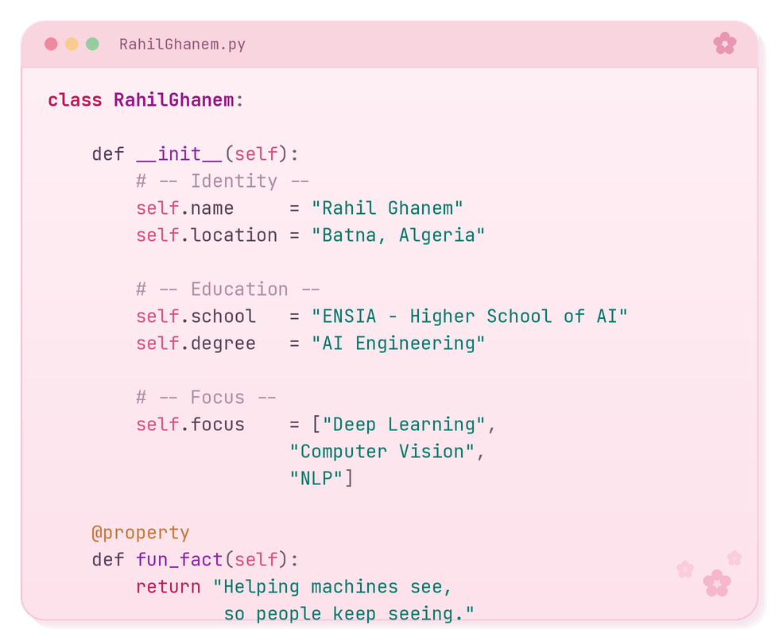
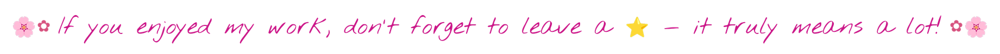

<!-- ============================================================ -->
<!--   🌸 RAHIL GHANEM — GITHUB PROFILE README                    -->
<!--   Username : RahilGhanem                                     -->
<!--   Email    : rahil.ghanem@ensia.edu.dz                       -->
<!--                                                              -->
<!--   NOTE: this README references two local images:             -->
<!--         ./assets/about_me.png                                -->
<!--         ./assets/star_line.png                               -->
<!--   Add the "assets" folder to your repo root so they render.  -->
<!--   Everything else is generated by external services.         -->
<!-- ============================================================ -->

<!-- ============================================================ -->
<!--                        ✦ HEADER ✦                            -->
<!-- ============================================================ -->

<!-- Sakura blossom banner -->

 

<!-- ✦ NAME — Parisienne font via readme-typing-svg ✦ -->

  

<!-- Multilingual greeting — static -->
<h2>🌸 &nbsp; Welcome &nbsp; ✿ &nbsp; Bienvenue &nbsp; ✿ &nbsp; أهلاً وسهلاً &nbsp; ✿ &nbsp; Salam 3likom &nbsp; 🌸</h2>

<em>✨ Building AI with curiosity, creativity, and a little bit of pink ✨</em>

<!-- Animated role typing effect -->

  

&nbsp;

  

 

<!-- ============================================================ -->
<!--                       ✦ ABOUT ME ✦                           -->
<!-- ============================================================ -->

##  &nbsp;About Me

<table>
<tr>
<td valign="middle" width="62%">

  

</td>
<td valign="middle" width="38%" align="center">

</td>
</tr>
</table>

 

  

 

<!-- ============================================================ -->
<!--                       ✦ TECH STACK ✦                         -->
<!--            Hexagonal "3D gem" cluster of tools               -->
<!-- ============================================================ -->

 

<!-- Rows form a hexagon: 6 / 7 / 8 / 8 / 7 / 6 -->

 

 

 

 

 

  

 

<!-- ============================================================ -->
<!--                       ✦ PHILOSOPHY ✦                         -->
<!-- ============================================================ -->

 

🌸 &nbsp;

&nbsp; 🌸

 

 

<!-- ============================================================ -->
<!--                        ✦ FOOTER ✦                            -->
<!-- ============================================================ -->

 

 

&nbsp;

<!-- Add your own once you have them:
&nbsp;

-->

  

  
  &nbsp;
  
  &nbsp;
  

 

<!-- Star line — rendered in the "Nothing You Could Do" script font -->

  

